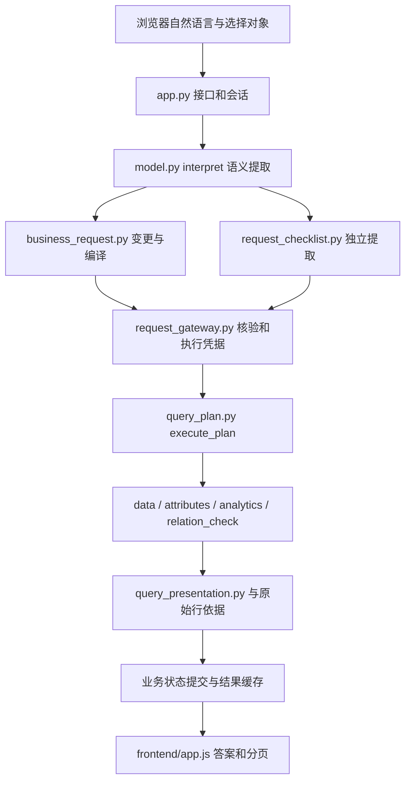

# 代码阅读指南

版本：V1｜整理日期：2026-10-08｜用途：当前工程交接；非客户正式验收。

当前源码有两条问答链路。普通问数以结构化请求和双模型核验为主，本机智能体以模型选择只读工具为主；两者共用部分数据执行能力，但不共用对话状态。阅读时先从各自入口开始，不把 agent_demo 当作云端后台。

## 普通问数主调用链

此图是责任层概览，不代表每个问句必经完全相同的分支。`model.interpret()` 可返回类型化业务请求，也可走兼容旧意图；`bind_references()` 再接入能力对应的核验入口。普通集合、属性和单根构型下级已有迁移适配，关系和统计仍有专用流程。旧协议存在，不代表可以绕过新校验。

|先读文件|关键入口|职责与检查重点|
|---|---|---|
|backend/app.py|Handler.do_POST|Host/Origin、登录、Token、数据版本、busy、取消后会话身份、计时、发布结果|
|backend/model.py|interpret、bind_references、validate|路由提取与结构修复、计划兼容、统计复核、将自然语言约束交给后续核验|
|backend/business_request.py|apply_delta、compile_task、compile_selected、commit_state|原话分段、稳定任务和条件编号、新建/续改、来源核对、只提交已执行成功任务|
|backend/request_checklist.py|prefetch、extract、gate、reconcile|Pro 从原话独立提取完整条件；候选不进入独立提取输入；比对分歧及未执行草稿|
|backend/request_gateway.py|reference_context、migrate、migrate_descendants、seal、require_verified|引用来源、兼容适配、单次核验凭据；计划改变后必须重新核验|
|backend/object_scope.py|apply_scope、explicit_domain|完整新主体优先、对象域来源、完整别名与前缀区分|
|backend/request_contract.py|scope_context、ground_unit、enforce|旧意图槽位、单位字面依据、继承和需求丢失校验|
|backend/semantic_review.py|business_question|把有效解释分歧转换为单个业务问题，避免直接暴露技术枚举|
|backend/query_plan.py|execute_plan、execute_one、task_context|独立任务执行、单项失败、结果对应的会话上下文|
|backend/data.py|Store、filtered、obj、部件/测点关系方法|真实父链、原始行查询、记录全集；不按代码前缀替代树关系|
|backend/attributes.py|CATALOG、execute_attributes|属性目录、原字段映射、覆盖度、缺失值、数值展示|
|backend/analytics.py|GROUP_FIELDS、validate_analysis、execute_analysis|受限分组计数、占比、完整集合聚合和排名；不等于任意求和或极值|
|backend/related_parts.py、relation_check.py|execute_related_parts、execute|PBS/构型/字典的专用关系和现场部件类别核对|
|backend/typed_fields.py|decimal_value、canonical_unit|Decimal 精度、单位核验、18档阈值投影|
|backend/session_state.py|snapshot、restore、make_room|8小时签名续问、50会话空闲回收、20行首屏、证据复用|
|backend/importer.py|Imports.preview/commit/load|CSV表头、大小、冲突和环路校验；不可变快照、版本比较及全局发布|
|backend/web_auth.py|WebAuth.login/valid/logout|密码哈希、8小时 Cookie、尝试频率控制；不是企业账号权限平台|
|frontend/app.js|请求、消息渲染及对象/历史事件处理|业务口径与查询依据、澄清、状态区分、分页、选对象和快捷操作|

## 模型调用和耗时从哪里来

主模型由 DEEPSEEK_MODEL 指定，默认 deepseek-v4-flash；独立清单默认 deepseek-v4-pro。ICCM_REQUEST_ENGINE 默认 contract。ICCM_PARALLEL_CHECKLIST 默认1，在条件满足时提前并行提取独立清单，仍须在 gate 汇合。没有可复用的预取结果时，gate 再执行提取。

路由结构修复、类型化草稿重提取、部分旧统计复核等可能增加往返。ICCM_ENDPOINT_REVIEW 和 ICCM_TYPED_ENTRY_RETRY 默认关闭，不能把实验分支当作线上默认路径。HTTP 为非流式最终响应；server_ms 是服务端本轮计时，timings_ms 区分 planning/execution，均不含浏览器完整渲染。

## 会话中几个易混的状态

|状态|含义|不能混用的边界|
|---|---|---|
|entity、用户 selection|已执行主体或用户点选对象|候选命中不自动变成用户确认|
|pending_question/pending_reference|待补原问句和未确定引用|短答必须填原未决问题，不能当成独立新查询|
|business_request / pending_business_request|已保存任务与尚未执行草稿|成功状态和草稿不能互相覆盖|
|query_receipt / last_success|已经执行的范围和结果依据|模型计划、说明文字、分页记录不是执行回执|
|results|服务端完整结果缓存|首屏20行不能替代全部记录或业务计数|
|dialogue|最近最多6轮模型所需对话摘要|不等同于浏览器最多100轮历史展示|

重点检查 `app.py` 更新 context 与 `business_request.commit_state()` 的先后关系。兼容的单对象状态、类型化任务状态、草稿以及显式点选同时存在，是当前阅读难点。任何分析结论都应注明实际路径和原话依据。

## 本机智能体调用链

`agent_demo/server.py` 创建独立会话并发送 turn；`runtime.py` 与安装的 Codex App Server 经 JSONL 通信。默认 Luna/low，可为新会话选择 Sol 或 Astra。终端、文件、网页、外部应用工具被禁用，仅注册本项目只读动态工具。

`tools.py` 的 DataTools 复用数据执行器；`bindings.py` 只核验紧邻标识的对象域限定；`knowledge.txt` 提供概念和证据使用规则；`query-guide.txt` 是独立工具协议。`presentation.py` 展示已理解计划及实际查询口径；`answers.py` 根据执行回执生成最终事实答案，模型草稿另留审计。模型只宣布计划却未取得业务回执时最多补发一次 completion-check；这不是常规版双模型核验。

## 如何分析一个失败样本

保留原问句、完整前文、显式选择、数据version及每轮返回。检查 trace 的 context_route.extracted、decision、business_request_delta、candidate/compiled/validated intent、独立 extraction、实际 query_receipt。名称/编码/identity 要分开；新主体与旧主体、类型与层级、查询范围与显示页、提供0值与未提供值要分别核对。

trace 只在鉴权查询请求中显式设置 true 时返回，可能包含脱敏业务内容；不宜直接发到公开Issue。测试回放有模型调用和会话清理副作用，运行前阅读其入口，不直接执行所有 replay 脚本。
