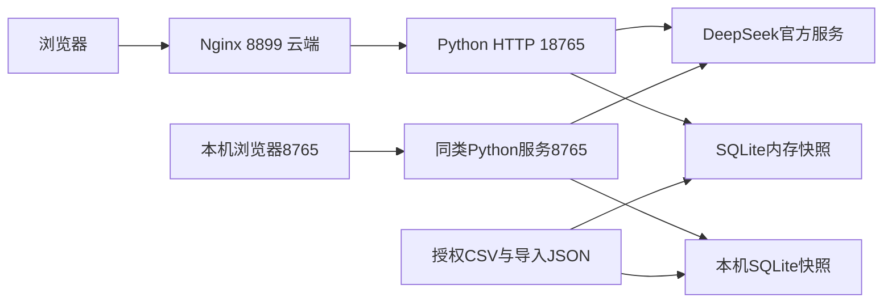

# 系统架构设计

2026-10-09发布候选：本次仅发布DeepSeek普通版公共机制修复，活跃协议V32/V28/V25、业务请求V10/独立清单V13；Codex智能体保留已提交交接版本。发布状态和本轮实测以[普通版r12发布记录](../07-部署与运维/DeepSeek普通版r12发布记录-20261009.md)为准；下文旧日期的“未发布”及r11表述为历史事实，不代表本轮最终状态。

版本：V6｜2026-10-09｜本地第三轮公共机制修复；腾讯云r11及公开交接副本未更新，非正式验收。

追加会话时序：每个在途请求有独立所有权；完成状态及续问签名后，先释放自己的标记再发送结果。迟到finally不得释放下一请求。数量越界的类型化业务约束由结果目标校验器产生，经独立提取接入传递；清楚提示1至100范围且不执行。网络、其他结构错误不改称业务拒绝。默认身份元数据投影只在逐项证明后参与全部未来任务状态比较；不能仅凭当前答案相同忽略new/update或丢弃其他分支。

2026-10-08追加本机优化：合法但缺数据的任务保存pending_business_request草稿及pending_tasks稳定编号；多任务只清除本次实际完成项，未执行或仍失败的分支继续保留。先前成功business_request与当前待补草稿分开；全部待补任务完成才提交整组，明确整组new不继承旧待补任务编号。HTTP、签名续问和前端采用同一状态语义。

PBS根对象范围内的测点是自身及全部后代的实际父链关联集合，走已实现带entity的专用路径；根标识不进入测点自身identity筛选。附加来源/状态/名称筛选独立保留；单个测点属性读取仍是单点定位。页面business_scope来自实际执行依据，删除无条件的“全部测点”标签。

日历日/月date_equals与精确对齐业务时区的半开区间按数学边界归一，不按条数猜测；时刻相等、微秒偏移、错上界和无效日期不合并。仅唯一实际原对象、单精确身份条件、身份属性及名码投影时，跨树objects定位与该实际树定位可规范为同一语义；多对象、列表、额外筛选及其他投影保持域差异。

2026-10-08公共机制扩展：属性未命中的code/identity候选语义仅在同一完整原标识、全部非空候选原行集合相等且其他条件一致时等价，不认证已读取属性。点选闭合续问由澄清层在当前数据、当前待答任务及原其他筛选下核验候选归属，只替换身份条件；重新绑定并消费一次执行凭据。后续继承必须核对服务器保存的selection树/编码与精确命中，不能要求短答重复完整编码，也不能相信模型自造来源。前端以完成回执区分差值计算与零记录，不把total=0当作所有输出的统一空结果判据。

普通版为Python标准库HTTP单体服务、SQLite内存数据层和原生浏览器前端。服务启动时加载种子CSV或活动导入快照，构建对象、祖先和测点索引；查询只读。数据导入是独立的显式发布流程，持久快照保存在inputs/imports或云端链接目录。

|责任层|实现|边界|
|---|---|---|
|界面|frontend HTML/JS/CSS|最终响应、历史、对象选择、依据；无前端密钥|
|API与状态|app、session_state、web_auth|登录、同源/Token、单会话在途、签名续问和结果缓存|
|语言与核验|model、business_request、request_checklist、request_gateway|结构化提取、来源、条件、单位、任务一致性；不允许自由SQL|
|执行|data、query_plan、attributes、analytics、relations|参数化检索、真实关系、完整集合计算和原行证据|
|导入|importer、import_schema|预检、immutable快照、版本比较后切换|

主提取与独立清单可并行，但结果须在核验层汇合。本地当前普通请求使用V10、独立清单V13：结果目标result_goal与过滤、投影分开，进入双方语义比较、未来任务状态、计划编译及执行回执。result_goal负责排序、极值、纯算术差值等受限动作；query_plan在完整筛选集合上执行，只有获得completed回执才报告完成。关系执行器原生返回下级列表及计数，对这两种交付等价核验；不豁免不支持的计算动作。单条测点的默认快照列表与完整默认属性投影仅在定位到同一唯一原始记录、所需字段可对应且目标为records/attributes时等价；不能据此豁免极值、排序、计数或差值。时间原文年筛选与日历年范围只有在全部原始时间逐行证明等价时才归一，遇到含年份的无效时间仍保留分歧。旧关系、分组等专用路径继续保留，不能声称所有路径已统一为一个DSL。

合法任务草稿与成功业务回执分别保存。未决身份字段和对象树补答绑定到具体任务、条件编号和值；明确属性短答只有在已成功的单对象属性任务上才改变读取投影。程序重新从当前会话计算补答结果，校验凭据仍一次消费。对象候选不算成功，不能清空已有目标。名称简称和并列省略引用仅在原文、字段目录和实际数据核验成立时展开，保留原值及来源；不推断任意尾码。

快捷操作可用性由operation_capabilities调用当前只读执行器核验。GET /api/operations返回对象、数据版本及操作enabled/reason；前端按相同版本缓存并展示，不用仅按对象树的硬编码按钮冒充可用能力。数据缺失不通过造值补齐。日期解析、Decimal运算与原行证据仍由确定性层承担，不增加模型或第三方依赖。

本机Agent是另一个HTTP进程，连接Codex App Server并注册只读动态工具。它没有部署到腾讯云，不直接作为普通版的第二个模型。RAG未接入，无向量数据库。

采用轻量单体便于本机POC和原始依据核对，代价是内存会话、共享导入、单进程实例、有限容量和演示级运维。尚无高可用、并发吞吐、企业权限或生产故障恢复验收。部署事实以07目录最新r11段落为准，不以历史标题判定当前版本。
