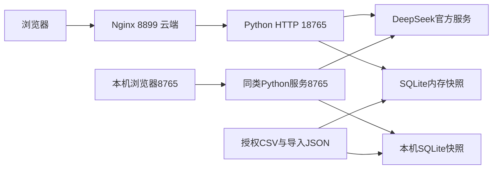

# 系统架构设计

版本：V1｜整理日期：2026-10-08｜用途：当前工程交接；非客户正式验收。

普通版为Python标准库HTTP单体服务、SQLite内存数据层和原生浏览器前端。服务启动时加载种子CSV或活动导入快照，构建对象、祖先和测点索引；查询只读。数据导入是独立的显式发布流程，持久快照保存在inputs/imports或云端链接目录。

|责任层|实现|边界|
|---|---|---|
|界面|frontend HTML/JS/CSS|最终响应、历史、对象选择、依据；无前端密钥|
|API与状态|app、session_state、web_auth|登录、同源/Token、单会话在途、签名续问和结果缓存|
|语言与核验|model、business_request、request_checklist、request_gateway|结构化提取、来源、条件、单位、任务一致性；不允许自由SQL|
|执行|data、query_plan、attributes、analytics、relations|参数化检索、真实关系、完整集合计算和原行证据|
|导入|importer、import_schema|预检、immutable快照、版本比较后切换|

主提取与独立清单可并行，但结果须在核验层汇合。部分旧意图仍有单独规划/复核和适配，当前并非唯一统一DSL执行通道。兼容层和多状态源是接手分析重点，详细入口见代码阅读指南。

本机Agent是另一个HTTP进程，连接Codex App Server并注册只读动态工具。它没有部署到腾讯云，不直接作为普通版的第二个模型。RAG未接入，无向量数据库。

采用轻量单体便于本机POC和原始依据核对，代价是内存会话、共享导入、单进程实例、有限容量和演示级运维。尚无高可用、并发吞吐、企业权限或生产故障恢复验收。部署事实以07目录最新r11段落为准，不以历史标题判定当前版本。
