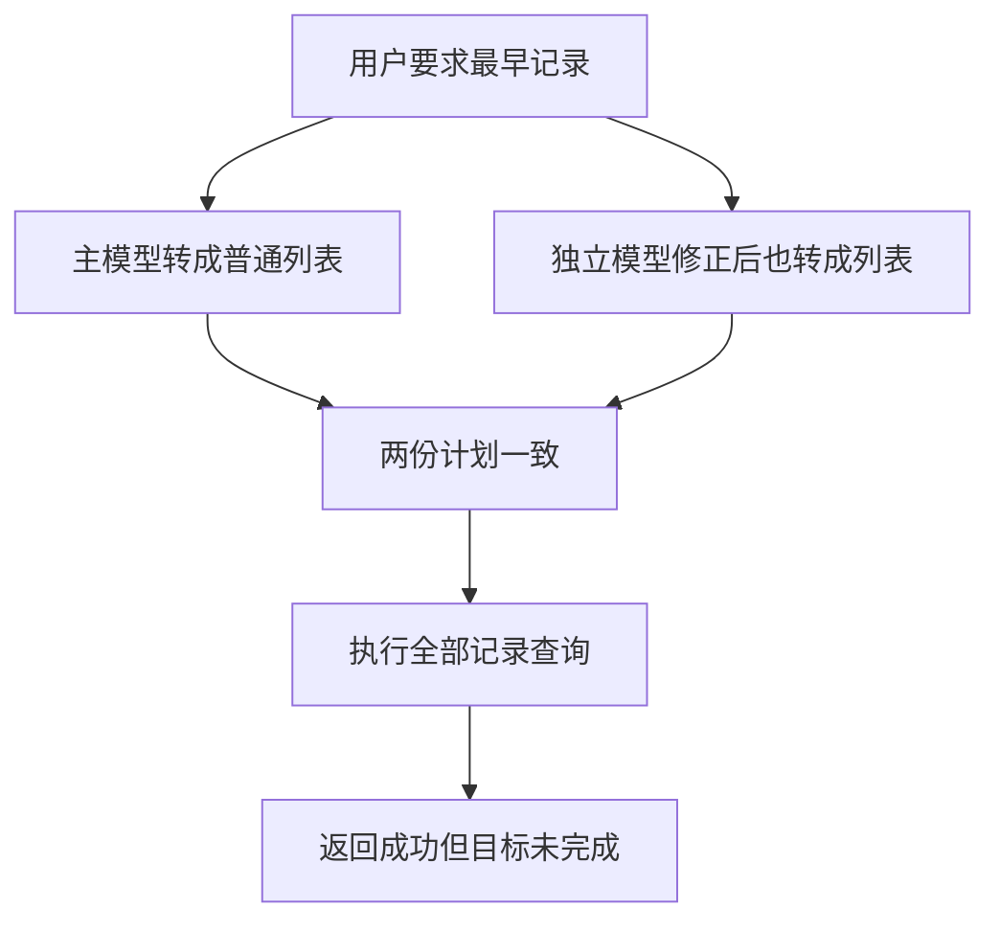

# 第三轮反馈与未解决问题

2026-10-09发布候选：本次仅发布DeepSeek普通版公共机制修复，活跃协议V32/V28/V25、业务请求V10/独立清单V13；Codex智能体保留已提交交接版本。发布状态和本轮实测以[普通版r12发布记录](../07-部署与运维/DeepSeek普通版r12发布记录-20261009.md)为准；下文旧日期的“未发布”及r11表述为历史事实，不代表本轮最终状态。

版本：V3｜2026-10-08｜状态：第三轮公共机制已在本地实现并完成本轮验证；腾讯云r11及GitHub交接副本未更新。用途：内部工程分析；非客户正式验收。

## 本轮修复结果与边界

用户授权“计划模式和目标模式 修复”后，按公共责任层实施，未改动原始CSV、云端服务或GitHub。现在本地源码已包含结果目标契约、连续补答状态、日期语义、有限计算及操作可用性。下文“诊断阶段”保留V2的39次云端诊断事实；其中“未修复、缺能力、待实施”等结论描述修改前r11，不能当作本地新源码现状。

|反馈组|本地实际结果|关闭范围及保留限制|
|---|---|---|
|阈值/名称短答/排序|原链“测量点11的阈值是多少→名称→所有的，按高低排序”完成；18项字段保留，已提供数值为90、80、34、30、20，缺失项列末尾。完整名称续问与实际页面也完成。|身份短答绑定未决槽位；已确认任务的名称属性追问只改投影，后续“所有”恢复全部阈值。短名称扩展必须由当前数据字段及唯一实体证明，不任意猜别名。|
|TMP计数|名称包含TMP为0；测点编码包含TMP为737，与原始CSV一致。|原诊断已证明该项不是contains能力故障；不把“名称”偷偷改成“编码”。|
|MOHB换树|介绍MOHB→PBS得到8029候选、展示20项；“那构型呢”读取构型MOHB，“设备类呢”读取设备类MOHB。|候选未被自动选中，属性未提前读取；合法任务草稿持续保留。树切换只改对象域。|
|最早/最高/TopK|三次“最早”均返回1970-01-01 08:00:00及1461条并列，基于全部12985条筛选；时间降序Top3完成。混合单位最高先澄清，明确摄氏度后最大70.80151367。|日期排序与极值在完整集合计算；空/无效时间不参与比较，1970保留。混合或缺失单位不直接混算；最高数值不等于故障严重度。|
|五月/差值|“今年5月份”和明确2026年5月均829条；“测量点名称7和6”两对象正确绑定。明确纯数值后7减6=1.447999954，反向=-1.447999954。|“今年”以Asia/Shanghai业务时钟为准，不固定数据年份。原差值先提示物理量/单位不足；仅纯算术确认后计算，保留方向、两条读数及测量时间。|
|1970口语|“时间是1970”“测量时间是1970”“包含1970年”三个连续变体均1461条。|年月日精度用日历半开区间；纯时间戳用精确时刻。文本年份与日期范围仅在当前完整数据逐行证明等价时合并核对，不能因为条数碰巧相等而合并。|
|原图对象按钮|实际浏览器选中XXXX2073后，四项分别提示缺构型关联、无匹配监测记录、阈值对象未命中、缺报警事件。正常推荐对象仍能查询设备及51个直接/221个全部下级部件。|后端按实际只读证据返回能力状态；前端禁用不可执行项并显示原因。手机390像素界面未横向溢出。源数据缺口没有用代码补造。|

共同修复入口：`result_goal.py`把记录、计数、属性、排序、极值、差值及不支持目标纳入任务；V10业务请求和V13独立清单均保存该目标，主提取与独立核对不共享本轮候选结论。编译、来源绑定及执行凭据覆盖目标参数，成功计算返回`goal_receipt`。修正不能以删除目标字段通过新协议；旧协议有来源的兼容输入仍受校验。日期在`date_fields.py`确定性比较；补答在`clarification_state.py`核对当前状态和明确选项；并列名称与字段简写分别通过经过实际数据验证的引用进入同一请求。新增Prompt为V27/V23/V19，旧版本保留。

只对经证明的原生等价结果统一核对：关系查询本来同时交付记录与数量；精确唯一测点的默认快照列表与同样五项属性可等价；年份比较须通过日历或逐行数据证明。其他筛选、投影、极值、差值与未来状态仍须一致，不能用等价处理绕过目标审查。不支持的任意测量值求和明确拒绝，没有降级为全部列表当答案。

## 最终本地验证

|验证|最终结果|真实证明范围|
|---|---|---|
|普通版离线|561/561，52.736秒|完整相关测试，包含目标缺失/非法参数、并列与空值、年月日、状态绑定、来源及执行凭据；不等于开放语言准确率。|
|Agent共享代码回归|44/44，2.407秒|现有Agent离线工具与呈现检查；本轮没有声称Agent真实模型全量复测。|
|第三轮真实模型链与变体|26/26步符合逐项预期|含原连续链、重复最早、明确排序、反向差值、1970变体、Top3、单位澄清及不支持求和；合适的澄清/候选/拒绝亦有不同断言，非26次数据查询成功。|
|历史正常真实模型回归|29/29步|获用户另行授权发送必要脱敏问句/上下文至api.deepseek.com；不包含未授权的13项留出题。|
|真实页面|排序、原图不可用按钮、正常部件操作、手机390像素|检查实际API/页面联动及可见内容，截图在本地证据；不等于腾讯云路径验收。|
|工程检查|前端运行回归、Python编译、JS语法及差异格式检查通过|无新增依赖、无自由SQL、无写设备动作。|

最终26步本地HTTP端到端耗时：中位2.7795秒、P95 3.354秒、最大3.575秒。历史29步中位2.686秒、P95 5.393秒、最大5.647秒，其中2步超过5秒。程序绑定明确短答无需模型，不能与每步都调用模型的任务直接比较。测试期间有独立回放并行，样本有限；以上不是腾讯云速度、严格压力测试或全部问题五秒达标的承诺。

最新实际模型标识为`deepseek-flash`及`deepseek-v4-pro`，thinking disabled，数据版本`70abf31549af`；基线Git仍`6d74d2d`。最终源码清单在`manifest-verified.json`（由live-closure清单去除macOS目录元数据.DS_Store，程序及Prompt逐项未变），规范化JSON清单SHA256为`230e80fc21a967100966c02ab8b8ee9944ed9a49a1d1a8207dc02f17e553c75d`。Prompt路径及配置见[Prompt资产管理](../04-AI设计/Prompt资产管理.md)；具体实现见[代码阅读指南](../03-架构设计/代码阅读指南.md)。

这轮多次真实复测曾发现结构修正降级、别名来源不一致、普通快照输出差异、年份提取差异、候选后的状态与界面布局问题。失败原始记录保留，最后一轮通过不能抹去这些证据。历史3项阈值断言原先仅接受旧threshold_details结构，现同步为当前attributes结构并继续严格核对原字段、数值、缺失和依据；没有修改原29道问句或降低业务预期。

本地本轮目标已达到；开放自然语言仍由模型解释，明确结构和双模型核对也不能证明从此所有新问法正确。保留的工作边界包括腾讯云制品部署及线上完整链验收、未覆盖的独立留出场景、源数据1970及空时间质量确认、单位/物理量定义、缺失构型映射与报警事件补源。GitHub与腾讯云未更新，当前本地实现不能作为已上线通知。

## 修复证据唯一登记

`docs/.staging/third-round-repair-20261008/`仅本地、不进入GitHub。`before-repair.tar.gz`和`previous-change.json`保留回退依据；`live-first`至`live-final-proof`及历史各轮保留开发失败和对照。最终取`live-closure/results.json`、`validation-summary.json`、`historical-closure/api-results.json`、`offline-closure.log`、`agent-closure.log`；结果语义按独立CSV预期核对，不只统计HTTP成功。API候选`total=20`表示预览行数，真实候选量在`outcome.candidate_count=8029`且`count_computed=false`，不可冒充已计算业务结果。

界面证据为`ui-sort-final.jpg`、`ui-unavailable-final.jpg`、`ui-unavailable-mobile-final.jpg`、`ui-normal-final.jpg`。早期未达到布局要求的截图同样保留。临时8780服务与自建测试会话用于隔离验证；回放会话已逐组清理，临时服务及测试页在收尾关闭。不更改既有8765/8771或腾讯云。计划及阶段完成登记见[第三轮公共机制修复计划](../05-专项设计/第三轮公共机制修复计划.md)。

## 诊断阶段V2历史记录（修改前r11）

以下完整保留2026-10-08诊断阶段；云端事实只对应当时检查，不代替未来在线状态核验。

## 结论与证据范围

第三轮反馈确实暴露了共同设计缺陷。最关键的缺陷是：系统能够核对两份查询计划是否一致，却不能保证这两份计划完整表达了用户要求。请求模型偏重“查什么对象、带什么条件、读什么属性”，对“从完整集合取最早记录、求极值、排序、计算两值差”等交付目标缺少表达。两个模型一起省略目标后，一致性检查仍可能放行。这不是继续增加几条问法提示就能稳定解决的问题。

本轮在腾讯云普通版完成39次诊断请求，包含第三轮原话及完整连续会话、对照问法、重复样本和4次引导按钮请求。39是请求数量，不是验收案例数或通过数；不能据此给出功能通过率。原始材料7组反馈、10张截图已保留。截图未提供当时完整trace和制品编号，不能断言所有历史行为与当前发布完全相同。

当前实测release为`20261008-r11`，服务active，数据version为`70abf31549af`。主模型响应标识为`deepseek-flash`，独立核对响应标识为`deepseek-v4-pro`。本地交接代码与云端29个后端Python文件的逻辑AST一致，78份系统提示词字节一致；前端app.js差异只有两处注释翻译。因此，本轮复现能够定位到当前交接代码中的机制，而不是仅凭历史记忆推断云端状态。AST比较已排除文档字符串和Python版本新增的空type_params字段。

GitHub交接基线仍为`6d74d2d`。本轮未修改业务代码、Prompt、原始CSV、导入快照或云端部署，未提交推送。使用自建测试会话，完成后请求清理这些会话并退出测试登录；没有操作用户其他会话。原反馈文档与V1记录均保留。

## 七组反馈逐项核对

|组别|原始反馈与本轮结果|判断与状态|
|---|---|---|
|1：阈值与短答|“测量点11的阈值是多少”先产生编码/身份筛选分歧；补“名称”后，主模型改为读取name属性，仍保留code=11；独立模型保留18项阈值，系统继续询问属性。补“所有的，按高低排序”仍未完成。改用完整原始名称“测量点名称11”，全部阈值读取成功。|短答未绑定未决条件，确认了上下文设计问题；阈值读取本身可用，阈值数值排序缺能力。不能把完整名称对照成功当原会话通过。证据g1-1至3、c1-1、c2-1至2。|
|2：TMP计数|原话“名字带TMP的测点有多少个”返回0；trace为name/contains/TMP。编码带TMP返回737。原CSV名称包含TMP=0、测量点编码包含TMP=737、源系统测点编码包含TMP=312。|本次名称查询正确，contains已实现。不能登记成“不支持子串检索”或假0，也不能未经用户确认把名称查询换成编码查询。证据g2-1、v2-1及独立原始行统计。|
|3：介绍MOHB及切换对象树|“介绍下MOHB”→“PBS”复现8029个模糊候选；“那构型呢”“设备类呢”再次索要对象。PBS候选结果后的context已没有business_request或pending_business_request；后续改走legacy。完整补“改在构型树中介绍MOHB”能读取构型MOHB，小类、层级3、父MOH。|对象未精确命中时，合法请求草稿没有持续保留在统一任务状态里；对象域切换丢失任务语义。MOHB在不同树的命中情况不同，不能自动替换成MOHB01。证据g3-1至4、c8-1至3。|
|4：最高、最早及“所有的记录”|原“已报警记录里测量值最高的是哪个”这次被独立核对拒绝，未重现历史48条列表。最早记录原链仍未完成。更明确的同一句“全部测点记录中，测量时间最早的是哪条”在三个独立会话中，两次澄清、一次返回全部12985条并标ok。|确认存在目标丢失后错误放行；重复样本表明同一release也不稳定。最高查询的历史误放行仅为截图事实，本次实际是能力拒绝。证据g4-1至3、v4-1、v5-1、c6-1、c7-1。|
|5：五月计数、两点差值|“今年5月份”被要求明确年份；明确“2026年5月”两次均422。主模型转为contains/2026年5月，独立模型生成时间gte/lt后被数值校验拒绝，修正仍失败。改成“测量时间包含2026/5/”成功829条。原“两点名称7和6，相差多少”因补全第二个标识缺原话依据而422；完整给出两个原始名称后两项读数成功，但差值仍未执行。|日期类型和自然语言归一化缺失；两个名称并列且第二个省略前缀时，没有受证据约束的结构化解析。差值还需要单位、物理量、时间及缺失值策略，不能仅修标识就宣布功能完成。证据g5a-1、g5b-1、v3-1、c3-1至2、c4-1、c5-1。|
|6：口语“时间是1970”|口语和明确“测量时间”两次均成功1461条，与独立CSV解析一致。|历史截图报独立提取失败，本次未复现；不能宣布此类口语永不再错。保留失败样本，作为稳定性对照。证据g6-1至2。|
|7：选对象后按钮|按原图的PBS对象XXXX2073、完整编码XJ1ABC002PO.PPR.1CGR054LP.RSQ、层级时序测点，执行前端相同引导请求：对应设备=incomplete；查看测点=ok且0条；阈值对照=not_found；报警时长=data_insufficient。|该对象存在于PBS，但不在监测CSV测点编码中；构型关联缺证据、监测记录缺失、事件数据缺失分别是不同原因。前端只按tree展示全部PBS按钮，未按类型、关系和数据可用性调整。四次操作为API复现，未声称完成浏览器点击验收。证据button四份记录及原图、frontend/app.js。|

## 关键失败的完整链路

同一句问题的实际失败证据是`c6-1.json`，不是根据源码猜测。

1. 输入：“全部测点记录中，测量时间最早的是哪条”。要求是找最早时间对应的记录，需要完整集合排序/极值及并列策略。
2. 主模型产生`search(points, filters=[])`，没有排序字段、方向、取首项或极值目标。
3. 独立模型首次尝试返回name/code/time属性，编译器要求“属性查询需要一个精确对象标识”，触发一次修正。
4. 独立模型修正后清空properties，也变成`search(points, filters=[])`。修正提示虽要求不得忽略原话，但程序没有检查“最早”目标是否保留。
5. `checklist_review.comparison.matches=true`，`same_future_state=true`，gate选择candidate、accept。
6. 执行器按列表查询执行，实际返回总数12985，首屏20条，status=ok。它没有计算最早记录，回答却呈现为一次成功的数据查询。

另两个完全相同的问题产生“未附加筛选”和“测量时间已提供”的分歧，进入澄清。三次结果都未完成最早查询；其中一次已突破正确性防线。样本数仅3次，不用于估算线上发生概率。

缺少排序能力本来可以明确拒绝。严重问题在于“不支持”没有成为确定性的能力约束，而是依赖模型是否主动声明；当两边都退化成合法列表，核对层看不见丢失的业务目标。

## 六问：共同机制与最低责任层

本轮按系统性缺陷处理。类别、不变量、共同机制、公共责任层、通用抽象及验证矩阵如下。建议均为待实施设计，不代表已经修复。

|问题类别|必须保持的不变量|共同失效机制及证据|最低公共责任层|应建立的通用规则|验证矩阵|
|任务表达与结果完成度|每个明确输出目标必须被执行，或被准确标明不支持；不能静默换成列表。|business_request普通查询只允许search/attributes；query只有target/filters，统计专用路径也仅有group_count/ratio。最早、数值排序、差值缺对应目标结构。c6同时丢目标仍放行。|业务请求模型、能力目录、编译器、执行回执。|任务独立保存对象范围、筛选、投影、结果动作及参数；无法表达时保留目标并拒绝。执行回执核对实际完成的动作。模型一致只是证据之一。|最早/最晚、最大/最小、排序/TopK、数量/列表、两值运算；空集合、并列、缺失、不同单位；不能完成时不得返回普通列表当答案。|
|模型输出修正与独立核对|结构修正不能删除任务目标；两个计划一致不等于完整理解。|c6独立修正删投影，gate仅比较规范化任务相等。span覆盖能够证明文本引用范围，不能证明该范围中的“最早”已执行。|统一模型输出接入、计划校验和独立核对。|修正前后保持语义目标及参数覆盖；输出清单缺项就失败。能力检测与计划有效性分开，不让模型把目标降级后绕过能力检查。|修正前后目标保持；双方共同漏项、互相分歧、一个不支持一个列表、多任务中一项不支持；精确检查完成度。|
|待补答交互|短答只更新当前待确认条件；原目标、对象及其他已确认条件保留。|g1“名称”变成属性；pending状态没有明确待答field/option。extraction_context将非domain/relationship的pending通通标awaiting_unit，身份或投影分歧也没有准确类型。|澄清状态机及输入绑定。|保存task_id、pending_slot、候选选项、提问原因、原目标和状态版本；补答先绑定槽位，越界输入再识别为新请求。|字段短答、对象树短答、范围短答、单位补答、属性补答；顺序、反悔、答非所问、换主题及连续澄清。|
|合法请求与执行结果状态|对象未命中或多候选，不能使合法请求草稿丢失；域切换只改对象域。|g3第二步ambiguous时，app用task_context替换context；commit_state只提交成功任务，也未在该路径保留先前pending草稿。后续从typed进入legacy，用户需重报MOHB。|会话状态、任务状态及兼容协议适配边界。|“已理解请求”“待定位对象”“已执行回执”分开存储；状态转换由明确规则处理。新旧协议进入同一内部任务模型，避免各自拥有竞争状态。|零命中、多候选、唯一命中、选候选、换树、查询失败后补答、切主题、旧协议导入及多任务。|
|日期与数据类型|业务日期范围与原始文本格式无关；时间比较不能走数值运算；相对时间依据明确。|time按文本字段处理，gte/lt仅接受NUMERIC_FIELDS；c5一边用中文文本包含，另一边用时间边界被拒。上下文没有足以稳定解析“今年”的统一业务时钟。|字段类型目录、归一化、业务时钟及确定性查询。|保留原始时间，同时建立经过校验的时间值；定义时区、业务基准时间、半开区间、无效/空时间和快照含义。不能把缺时间和不支持合并。|斜杠/横线格式、中文年月、自然年月、月底、跨年、空值、非法值、时区；1970原值与并列最早。|
|按钮能力与数据可用性|可用入口与对象类型、关联证据、监测/事件资料相符；不支持、无匹配、缺关系分别解释。|frontend/app.js setContext仅依tree生成按钮。该PBS时序测点无监测记录，仍展示设备、阈值、时长。|后端统一能力/关系可用性服务与前端组件。|按对象类型、快照、关联证据返回操作可用性和原因；界面使用同一能力目录。0结果仍允许，但应清楚说明实际范围与缺失资料。|PBS各层级、构型各类型、已/未关联对象、无监测记录、无事件记录、混合来源、正常可执行按钮；API与真实界面联动。|

### 代码责任入口

|入口|当前设计证据|
|---|---|
|`backend/business_request.py`：compile_task（约208行）、extraction_context（约100行）、commit_state（约464行）|普通任务表达范围；pending状态分类；成功/失败/澄清后的请求提交。|
|`backend/request_checklist.py`：extract（约187行）、gate（约404行）|一次修正机制；规范化比较后accept；分歧变成用户澄清。|
|`backend/semantic_review.py`：business_question（约34行）|按两个计划的字段/投影差异生成澄清，未建立准确待答槽位。|
|`backend/app.py`：约219至240行|outcome后替换context，并调用commit_state；需要连同task_context检查。|
|`backend/query_filters.py`：validate_query；`backend/typed_fields.py`：NUMERIC_FIELDS|请求只有target/filters等限定字段，时间字段未提供日期比较类型。|
|`backend/analytics.py`：validate_analysis、GROUP_FIELDS|已有分组计数和占比；不是全部聚合都不存在，但没有测量值/日期极值和差值。|
|`frontend/app.js`：setContext（约116行）、follow（约118行）；`backend/data.py`：execute|同一tree显示相同按钮；引导intent绕过语言模型后仍受关系/数据可用性限制。|

## 独立数据预期与业务边界

预期直接读取原CSV计算，没有用产品查询函数给自己作证。五份CSV校验值、行号和完整来源在本地证据中登记。

- 2026年5月测量时间范围为`[2026-05-01, 2026-06-01)`，按原始日期解析得到829条。斜杠文本对照得到同数只是本数据格式下的控制样本，不是建议让用户记住格式。
- 最早原始测量时间为`1970-01-01 08:00:00`，并列1461条。系统需定义返回并列全部、数量及摘要，或稳定取一条的业务规则，不能凭“是哪条”任意丢弃并列。1970可能值得核查来源，但本轮保持原值，不自动视为异常并排除。
- 48条已报警记录有不同或缺失单位。℃组39条，其中最大值为测量点名称4的70.80151367，原CSV第5行；单位为“3”的记录有87.26699829。不能给混合物理量一个业务最大值，也不能默认把所有报警都理解为℃。数值最高与故障最严重不是同一结论。
- 测量点名称6：0.526000023，时间2026/5/23 10:59，原CSV第7行；测量点名称7：1.973999977，时间10:47，第8行；两行单位均为空。纯算术“7减6”为1.447999954，但缺单位、物理量确认且时间不同，不能冒充经过业务确认的可比测量差。若未来提供纯算术模式，必须明确运算方向和数据边界。
- 图片选中的XXXX2073属于PBS时序测点，但监测CSV没有该完整编码；存在于PBS不等于有读数、阈值、构型映射或报警事件。报警时长需要开始/恢复事件，测量时间不能代替。

## 为什么会反复出现问题

本轮证据支持以下解释：系统已积累了字段、来源、数值单位、任务变更和独立核验约束，却没有把“业务目标完整表达”和“连续交互状态”同时纳入同一个可校验模型。局部修复可能提高特定问法的通过率，但新问法仍会遇到同一个表达缺口；新增校验还可能使模型修正为更简单的合法计划，而这个计划已丢失真正目标。

新旧请求协议并存又扩大了状态转换空间。未成功执行的typed任务，与legacy pending_request并非在所有结果状态下保持同一份语义。主模型和独立模型在缺少精确待答槽位时各自重新理解短答，新增Prompt约束无法替代稳定的状态机。以上有实际trace支持，不需要先假定是模型变笨、服务器资源不足或数据全面错误。

以前534项离线检查、29+13步云端复测证明的是当时覆盖的协议和场景。它们没有证明本轮的极值、日期、并列输出和连续补答完成度。当前测试应从“状态ok/合法计划/数量正确”进一步验证用户目标及后续状态，不把样例全部通过当整类问题已经关闭。

## 建议处理顺序与关闭条件

1. **先堵住错误成功。** 在共同请求与执行回执中保留结果动作及参数，建立确定性的能力拒绝和完成度核对；最早等不支持目标不能被删除后降级成search。修正输出也要检查目标保持。优先级高于新增计算功能。
2. **再统一待补答和候选状态。** 给澄清明确槽位和候选；保留合法请求草稿，将对象定位、业务请求、执行成功分别管理。通过现有路径的统一适配逐步迁移，不直接大规模重写整仓库。
3. **补数据类型和领域能力。** 日期、数值、单位、物理量、来源/测量时间进入统一字段目录。对极值、排序、TopK、差值逐项确定空值、并列、单位、重复来源和时间规则，再实现确定性计算。已有分组计数/占比继续保留并纳入同一能力目录。
4. **使界面能力与后端一致。** 对象按钮读取实际可用性和缺失原因；明确0条、未命中、关联不足、能力不支持、系统异常的区别。
5. **扩展验收方式。** 冻结原失败会话，增加同结构变体、重复请求、不同顺序及反例；分别检查目标、条件、结果粒度、计算口径、原始行依据和下一轮状态。先验证新矩阵，再回归历史正常场景，最后进行腾讯云完整路径与真实界面验收。

本轮六问已完成机制定位；实现、整类矩阵通过、历史回归、实际UI联动及“同类问题无需继续补丁”的关闭证明尚未完成，均保持开放。数据缺失类需补源或显示限制，不能用代码制造事实。修复和发布范围应围绕上述公共层另行明确；本轮只完成分析，不登记修复成功。

## 本地证据登记

证据目录：`docs/.staging/third-round-diagnosis-20261008/`，不进入GitHub。最终统计唯一依据为`evidence-summary.json`；源码语义对照唯一依据为`source-comparison-normalized.json`。

- `probe.py`、`probe2.py`：自建会话诊断步骤；每份`g*`记录保留原话，`v*`和`c*`为对照/重复。`meta.json`、`meta-second.json`保留经过敏感字段清理的数据与能力元信息。
- `g1-*`、`g3-*`、`c6-1.json`、`c7-1.json`、`c5-1.json`：中间状态、模型输出及修正、最终计划与核对结果。4份`button-*.json`为前端相同引导intent的API证据。
- `oracle-corrected.json`和`evidence-summary.json`：原始行、日期解析预期、校验值及汇总。首次oracle.json误用短名称和横线日期格式，保留审计但不采用其预期；后续根据原始CSV勘误。v6短名称7/6与实际完整名称不同，不据此认定原题故障。
- `source-comparison.json`首次跨Python版本AST序列化造成假差异，保留过程；最终已在同一解释器比较并排除空type_params字段。29个后端逻辑与78份Prompt一致，前端仅两处注释不同。
- `第三轮反馈-V1分析前.md`保留分析前记录；第三轮原件仍在外层，公开文件统一称《数据开发团队测试情况3.docx》。以前发布与交接记录仍按原日期读取，不覆盖原验收结论。
